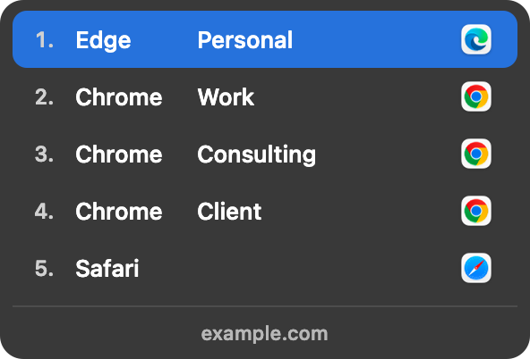
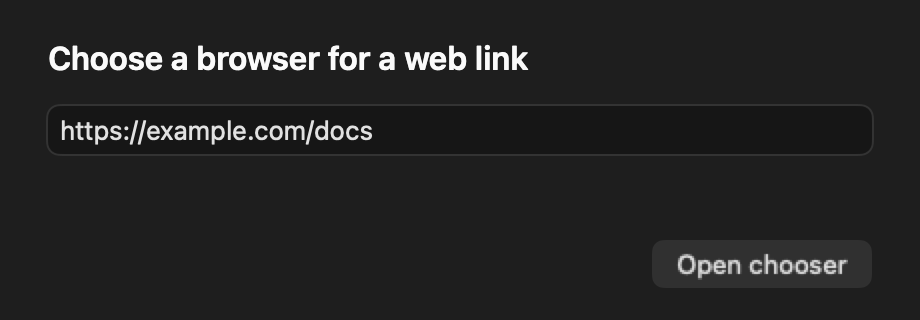

# Browser Chooser

I keep separate browser profiles for personal and work, and I got tired of opening a link in the wrong one. Browser Chooser puts a small menu beside the pointer so I can choose the right profile with a click or a number key. It's my independent Swift/AppKit successor inspired by [Browserosaurus](https://github.com/will-stone/browserosaurus), not a fork or an affiliated project.

I've been enjoying prompting my AI agent, Codex, on the side to build small, practical tools that help me as I go, without getting in the way. Part of me misses spending days learning a language, a framework and its tooling, then building something myself and knowing every line. Yet here we are :)



*The screenshots use demo profile names and `example.com`, not my browser data.*

## What it does

- Offers local Chrome and Microsoft Edge profiles plus Safari for `http` and `https` links. Custom app schemes stay with their own handlers.
- Shows the destination host below the list. Click a row, press `1` to `9`, or press Escape to cancel.
- Can send an exact host, a path within it, or a link containing a configured domain straight to a chosen profile. If that profile is unavailable, the chooser opens with a warning.
- Opens this manual URL window when launched without a link:



Chrome and Edge profile names come from local browser metadata when the chooser opens. The app does not read cookies or account credentials.

## Routing rules

Open Settings from the chooser gear, the manual URL window, or `⌘,`. Paste a web URL or enter a host such as `work.example.com`, choose a discovered profile, and save. Leave **Path prefix** empty for every path on that host, or enter one such as `/acme` for a narrower rule. The host must match exactly, so a subdomain needs its own rule. You can edit, disable, or delete rules in Settings.

For `github.com`, `/acme` matches `/acme` and `/acme/repo`, but not `/acme-other`. A more specific path rule wins over a host-only rule; existing host-only rules keep working. You can save multiple prefixes for the same host.

For broader routing, choose **Domain in URL** in Settings and enter a domain such as `personal.example.com`. It matches that domain or its subdomains when they appear in the link's host, path, query, or an email address in the link. It won't match `notpersonal.example.com` or `personal.example.com.evil.test`. Exact host and path rules take priority. You only save the domain, not the link or email address.

[Microsoft Safe Links](https://learn.microsoft.com/en-us/defender-office-365/safe-links-about) may wrap a web link for checking when you click it. For a recognized HTTPS Safe Link, Browser Chooser checks its embedded HTTP/HTTPS destination against these same routing rules. A wrapped link to `work.example.com` can follow that rule, but the original Safe Link opens in the selected browser, keeping Microsoft's check in the path. Other Outlook links get no special route. Unrecognized wrappers are treated like ordinary links; malformed recognized Safe Links and links without a matching rule open the chooser. There's no catch-all Outlook rule, and the wrapper, email data, and tracking parameters aren't saved or logged.

Once you've built the app, there's a command line path too:

```sh
APP='build/Browser Chooser.app/Contents/MacOS/BrowserChooser'
"$APP" --add-rule work.example.com --profile chrome:Default
"$APP" --add-rule github.com --path-prefix /acme --profile chrome:Default
"$APP" --add-rule personal.example.com --url-domain --profile edge:Default
"$APP" --explain-route https://github.com/acme/repo
```

`--explain-route` is a dry run and doesn't open a browser. `"$APP" --settings` opens Settings.

## Where settings live

The installed app uses `UserDefaults.standard` for the `dk.lvc.browserchooser` application domain, normally stored at `~/Library/Preferences/dk.lvc.browserchooser.plist`. The `routingRules.v1` key holds JSON-encoded data: each rule saves a `host` (also used for a Domain in URL rule), an optional `pathPrefix`, a browser/profile directory `profileID`, an `enabled` flag, and an optional `matchKind`. Older rules without `matchKind` remain exact-host rules. Rules don't save email addresses, full URLs, query strings, fragments, cookies, or credentials. They stay local and aren't uploaded to GitHub.

An enabled exact-host rule matches that host for both HTTP and HTTPS links, and its path prefix if set. Links without a matching enabled rule open the chooser. If the browser or saved profile directory isn't available, the chooser opens with a warning. App updates keep the same preferences; when moving to another Mac, check the profile IDs because its browser directories may differ.

Settings is the safest place to edit rules. macOS caches preferences, so don't hand-edit the plist. Once you've saved a rule, quit Browser Chooser and back up the whole app preferences domain to a private file outside this repo:

```sh
defaults export dk.lvc.browserchooser "$HOME/browser-chooser-settings.plist"
```

To restore it, quit the app, then run:

```sh
defaults import dk.lvc.browserchooser "$HOME/browser-chooser-settings.plist"
```

The backup can reveal sites you route, so keep it private. Importing may replace current preferences; reopen the app and check the rules afterward.

## Build and try it

You'll need macOS 13 or later, Swift 6, and a valid Apple Development or Developer ID Application signing identity on your Mac. I haven't published a prebuilt or notarized download.

```sh
swift test
./scripts/build-app.sh
./scripts/trial-url.sh
```

The build script creates `build/Browser Chooser.app` and signs it with the only valid matching identity it finds. If you have more than one, set `BROWSER_CHOOSER_SIGN_IDENTITY` to the identity fingerprint. The trial opens `https://example.com` by default, or another web URL passed as its first argument. It doesn't change your default browser.

To install the signed build in `/Applications` and check link delivery:

```sh
./scripts/install-app.sh
open -a '/Applications/Browser Chooser.app' 'https://example.com'
```

The install script registers the app but doesn't make it your default browser. On my Mac, it didn't appear in the System Settings default browser menu. After checking that links reach the installed app, you can set it as the default for `http` and `https` with:

```sh
swift scripts/set-default-browser.swift --apply
```

The helper reads back both web handlers. macOS may also change your HTML file opener; if it does, restore your previous app through Finder's **Get Info > Open with > Change All**. The helper doesn't change file or custom-scheme handlers itself.

macOS may ask for **Files & Folders** access to read Chrome and Edge profile names. If the chooser can't read profiles, allow Browser Chooser in **System Settings > Privacy & Security > Files & Folders**, then fully quit and reopen it.

This is a source-built personal project. I've tested profile discovery, URL validation, chooser selection, launch into installed profiles, and default web link routing locally. There are still rough edges, so feel free to poke around.

MIT licensed. See [LICENSE](LICENSE).
